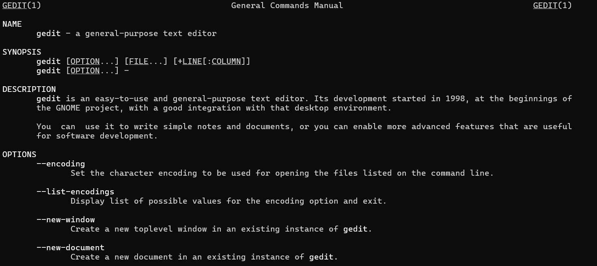
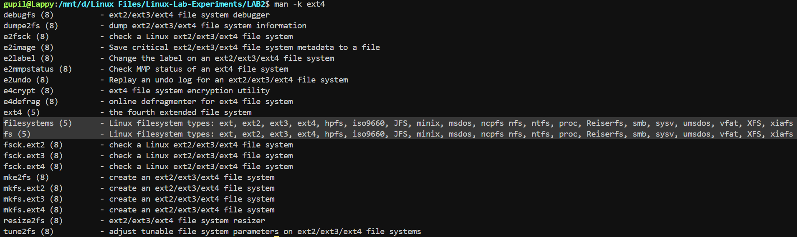
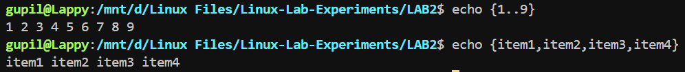

# Lab Experiment - 2
**Gedit Man Page:**\
View the gedit man page.

``man gedit``

**Fixing ext4 Parameters:**\
Use the ``man -k ext4`` command to locate the command for tuning ext4 file-system parameters.

``man -k ext4``

**Understanding Brace Expansion:**\
Brace expansion generates discretionary strings of characters. Braces enclose a comma-separated list of strings or a sequence expression, and the resulting text includes any content that precedes or follows the brace definition.

``echo {1..9}`` ``echo {item1,item2,item3,item4}``

