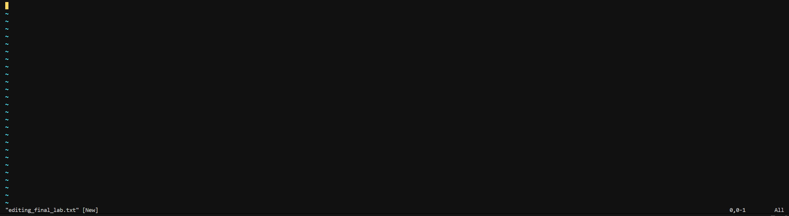
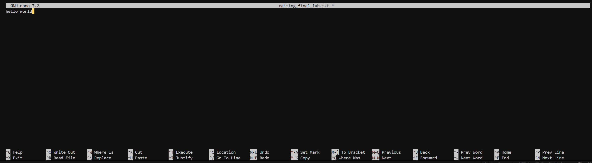
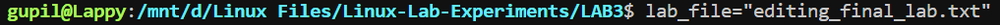

# Lab Experiment - 3

Use Vim,nano, to edit the editing_final_lab.txt file. Use the
lab_file shell variable. Enter the visual mode of Vim. Remove
the last seven characters from the first column on the first
line. Preserve only the first four characters of the first
column.
**Vim:**
``
vim editing_final_lab.txt
``

**Nano:**
``
nano editing_final_lab.txt
``

**Shell Variable:**
``
lab_file="editing_final_lab.txt"
``

