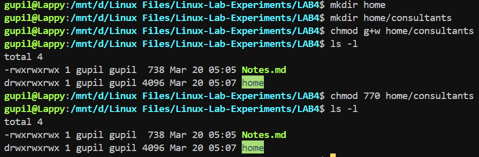

# Lab Experiment - 4

**Permission Management:**
- Create the /home/consultants directory.

- Add write permission to the consultants group. Use the symbolic method for setting the appropriate permissions.

- Forbid others from accessing files in the /home/consultants directory. Use the octal method for
setting the appropriate permissions.

``
mkdir home
``\
``
mkdir home/consultants
``\
``
chmod g+w home/consultants
ls -l
``\
``
chmod 770 home/consultants
ls -l
``

Change the default umask for the operator1 user. The new umask prohibits all access for users that are not in their
group. Confirm that the umask is changed.

